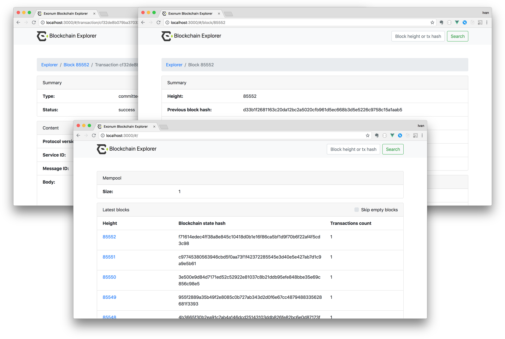

# Exonum Blockchain Explorer

An application for monitoring blocks and transactions in Exonum blockchain.



## Use with different Exonum core versions

Explorer compatibility with Exonum core:

| Core version | Tag |
|---|---|
| `0.10.*` | `v0.10` |
| `0.9.*` | `v0.9` |
| `0.8.*` | `v0.8` |
| `0.7.*` | `v0.6` |
| `0.6.*` | `v0.6` |
| `0.5.*` | `v0.1` |
| `0.4.0` | `v0.1` |
| `0.3.0` | `v0.1` |
| `0.2.0` | `v0.1` |
| `0.1.*` | `v0.1` |

## Setup

First, install dependencies:

```sh
npm install
```

## Starting as a Node.JS server

Build sources:

```sh
npm run build
```

Run app:

```sh
npm start -- --port=3000 --api-root=http://127.0.0.1:8200
```

`--port` is a port for Node.JS app.

`--api-root` is a root URL of Exonum node public API.

## Build a static html pages

CORS headers must be setted up in Exonum node configuration to use the application as static html pages.
See `allow_origin` parameter in [Exonum docs](https://exonum.com/doc/architecture/configuration/#api).

Build sources:

```sh
npm run compile -- --env.apiRoot=http://127.0.0.1:8200
```

`--env.apiRoot` is a root URL of Exonum node public API.

Run [index.html](index.html).

## LICENSE

Exonum Blockchain Explorer is licensed under the Apache License (Version 2.0).
See [LICENSE](https://github.com/exonum/blockchain-explorer/blob/master/LICENSE) for details.
